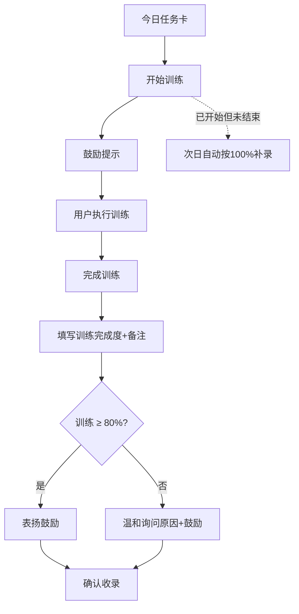
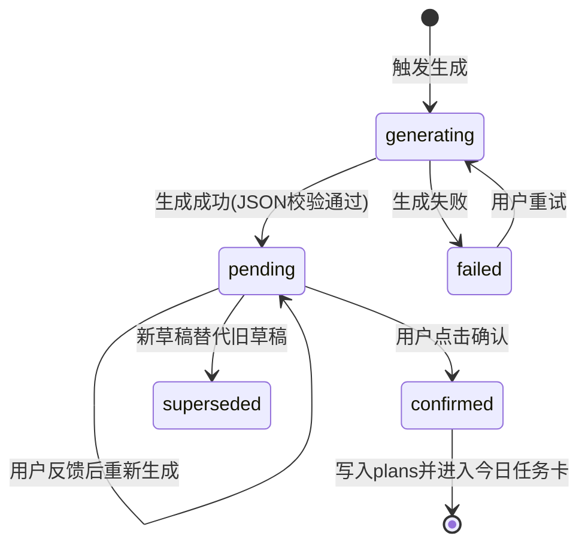
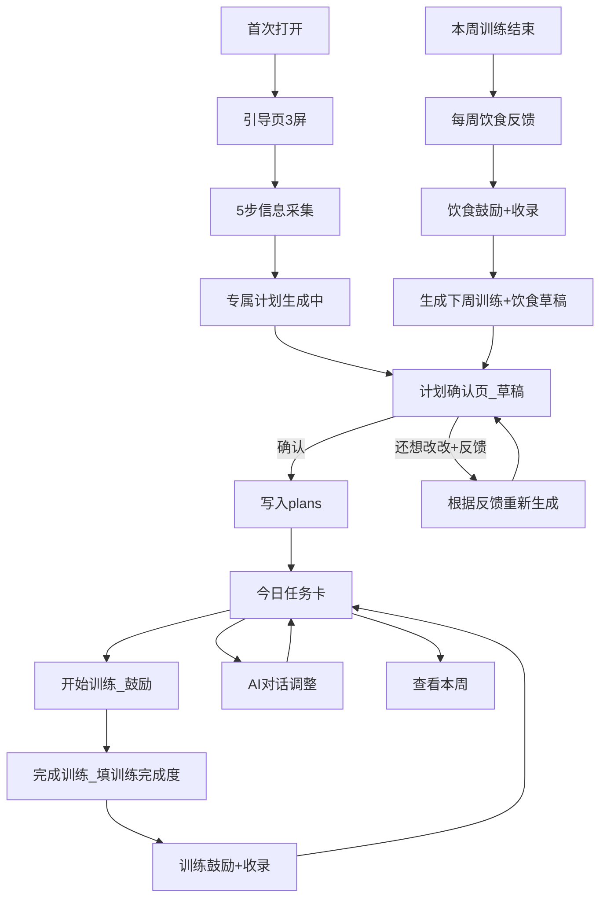

# AI 私教 MVP — 首体验与反馈闭环产品规格

> 本文档落实「首体验流程细化」方案，供设计与开发对齐。基线见 [prd.md](../prd.md)。

---

## 1. 最小必要信息采集（Onboarding）

### 1.1 设计原则

| 原则 | 说明 |
|------|------|
| 最少必要 | 仅收集生成首周计划所必需的字段 |
| 无敏感信息 | 不采集真实姓名、身份证、手机号（游客阶段）、精确地理位置、照片、生物识别等 |
| 可选身体数据 | 身高/体重/体脂/性别 **不作为 MVP 必填**；若用户自愿补充，仅用于粗略强度估算，且可随时跳过 |
| 分步减负 | 共 **5 步**，每步 **最多 1 个主问题**（饮食限制步可有 1 个主问题 + 快捷多选，仍计为 1 步） |
| 游客优先 | 完成采集并看到「今日任务卡」前 **不要求注册/登录**；在首次打卡成功或生成第二周计划前，轻提示绑定账号 |

### 1.2 字段清单（最终版）

| 字段 ID | 展示名 | 类型 | 必填 | 用于计划生成 | 备注 |
|---------|--------|------|------|--------------|------|
| `goal` | 你的主要目标 | 单选 | 是 | 训练分化、容量、饮食方向 | 减脂 / 增肌 / 塑形 / 保持健康 |
| `availableDays` | 每周能练几天 | 数字 1–7 | 是 | 周计划训练日数量 | 滑块或点选 |
| `availableMinutes` | 每次大约多久 | 单选 | 是 | 每日动作数量与组数 | 20 / 30 / 45 / 60 分钟 |
| `environment` | 主要训练场景 | 单选 | 是 | 动作库与替代方案 | 家庭 / 健身房 / 宿舍或户外 |
| `experience` | 运动基础 | 单选 | 是 | 强度与动作复杂度 | 零基础 / 有点基础 / 练过一段时间 |
| `dietRestrictions` | 饮食忌口（可多选） | 多选 | 否 | 饮食建议过滤 | 预设：素食、不吃猪肉、乳糖不耐、海鲜过敏、无特殊要求；支持自定义 1 条（≤20 字） |
| `equipment` | 家里/宿舍现有器材 | 多选 | 否 | 仅当 `environment` 为家庭或宿舍时展示 | 哑铃、弹力带、瑜伽垫、无器材 |

**明确不采集（MVP）**

- 真实姓名、性别（必填）、生日、手机号、邮箱（游客阶段）
- 身高、体重、体脂（默认不出现；设置页「可选补充」再开放）
- GPS、健身房名称、人脸/体态照片

### 1.3 分步向导结构（5 步）

```
Step 1/5  目标          → goal（单选，4 项）
Step 2/5  时间与频率    → availableDays + availableMinutes（同屏 2 控件，仍算 1 步）
Step 3/5  训练场景      → environment（单选）；若选家庭/宿舍 → 同屏展开 equipment（可选）
Step 4/5  运动基础      → experience（单选）
Step 5/5  饮食忌口      → dietRestrictions（多选，可全不选直接「完成」）
```

- 每步底部：**下一步**；最后一步：**生成我的专属计划**
- 支持 **上一步** 返回修改
- 预计完成时间：**≤ 90 秒**（文案提示：「约 1 分钟，不用填太多」）

### 1.4 提交后行为

1. 跳转全屏状态页，主文案：**「专属计划生成中」**
2. 副文案轮播（可选）：「正在按你的时间和场景定制本周计划…」
3. 成功 → 进入 **计划确认页**（见第 5 节）；**不直接进入今日任务卡**
4. 失败 → 友好提示 + 重试；后端降级时使用保守默认周计划（见第 4 节），仍须走确认页

### 1.5 数据模型（Onboarding 输出）

```typescript
interface OnboardingProfile {
  goal: '减脂' | '增肌' | '塑形' | '保持健康';
  availableDays: number;       // 1-7
  availableMinutes: 20 | 30 | 45 | 60;
  environment: '家庭' | '健身房' | '宿舍或户外';
  experience: '零基础' | '有点基础' | '练过一段时间';
  dietRestrictions: string[];  // 可为空数组
  equipment?: string[];        // 仅家庭/宿舍场景可能有
}
```

---

## 2. 今日任务卡（Today Card）

### 2.1 信息层级

| 层级 | 内容 | 默认状态 |
|------|------|----------|
| L0 顶栏 | 日期（如「周三 · 5月20日」）、本周第几天、轻量「查看本周」入口 | 始终显示 |
| L1 训练区标题 | 今日重点，如「胸 + 三头 · 约 35 分钟」 | 始终显示 |
| L1 训练动作列表 | 简洁动作行，见 2.2 格式 | 始终显示 |
| L2 训练备注 | 单行替代/注意（如「无龙门架可用哑铃飞鸟替代」） | 有则显示，无则隐藏 |
| L1 饮食区标题 | 「今日饮食」 | 始终显示 |
| L1 饮食要点 | 2–3 条短原则（每条 ≤ 15 字） | 始终显示 |
| L2 饮食示例 | 1–2 条食堂/外卖友好示例 | **可折叠**，默认收起 |
| L3 热量目标 | 数字 kcal | **可折叠**，默认收起 |
| 底栏操作 | 未开始：「开始训练」「找 AI 调整」；训练中：「完成训练」「找 AI 调整」；已结束：「已完成 ✅」「找 AI 调整」 | 始终显示 |

**首屏原则**：用户打开 App **3 秒内**能扫完今日要做什么；不出现 7 天任务列表。

### 2.2 动作文案格式规范

**标准格式**

```
{动作名} {次数}*{组数}
```

示例：

- `哑铃飞鸟 12*4`
- `高位下拉 12*4`
- `平板支撑 45秒*3`（计时动作：`{秒数}秒*{组数}`）
- `快走 20分钟*1`（有氧：`{分钟数}分钟*1`）

**规则**

| 规则 | 说明 |
|------|------|
| 次数 × 组数 | 使用半角 `*`，不用 `×` 或中文「乘」 |
| 动作名 | 中文常用名，≤ 8 字为宜；必要时括号备注器械，如 `哑铃卧推（平板）` |
| 排序 | 按执行顺序排列；同类复合动作可合并展示为「超级组」子列表 |
| 禁止 | 单条动作下不出现大段教学文字；教学放 P2 器材说明页或对话 |
| 组间 | 不在列表行展示；统一在 L2 备注或对话中说明 |

**饮食短句格式**

- 原则：`少油`、`高蛋白优先`、`晚餐七分饱`
- 示例：`午餐：一荤两素，米饭减半`、`晚餐：酸奶 + 鸡蛋代替外卖`

### 2.3 今日任务卡 UI 结构（示意）

```
┌─────────────────────────────────┐
│ 周三 · 5月20日        [本周 ›]  │
├─────────────────────────────────┤
│ 今日训练 · 胸+三头 · 约35分钟    │
│   哑铃飞鸟 12*4                  │
│   哑铃卧推 10*4                  │
│   绳索下压 12*3                  │
│   💡 无龙门架可用哑铃飞鸟替代     │  ← L2，可选
├─────────────────────────────────┤
│ 今日饮食                         │
│   · 午餐少油，蛋白优先            │
│   · 晚餐七分饱，少喝含糖饮料       │
│   [展开示例餐单 ▼]                │  ← L2 折叠
├─────────────────────────────────┤
│  [ 开始训练 ]    [ 找 AI 调整 ]  │
└─────────────────────────────────┘
```

### 2.4 「查看本周」页

- 以 **日历条 / 列表** 展示 7 天，每天一行摘要：`周一 背 · 4 动作` / `周二 休息`
- 点击某天 → 只读预览该日任务卡布局（不可批量编辑）
- 当天计划被 AI 调整后，该日卡片显示小标记「已调整」

### 2.5 数据模型（今日视图）

```typescript
interface TodayCardView {
  date: string;              // ISO date
  dayOfWeek: number;         // 0-6
  weekNumber: number;
  training: {
    focus: string;           // "胸+三头"
    estimatedMinutes: number;
    exercises: {
      displayLine: string;   // "哑铃飞鸟 12*4" 预渲染或前端拼接
      name: string;
      reps: string;          // "12" | "45秒" | "20分钟"
      sets: number;
      note?: string;
    }[];
  };
  diet: {
    principles: string[];    // 必填展示，2-3 条
    sampleMeals?: string[];    // 可折叠
    caloriesTarget?: number;   // 可折叠
  };
  isAdjusted: boolean;       // 当日是否被对话改过
}
```

---

## 3. 每日训练打卡（Training Check-in）

> 训练打卡按 **天** 进行；饮食反馈按 **周** 进行（见 §3A）。两者完全独立。

### 3.1 两次打卡机制（每日）

每个训练日分 **开始打卡** 和 **结束打卡** 两步：



| 打卡阶段 | 时机 | 用户操作 | 系统响应 |
|----------|------|----------|----------|
| **开始打卡** | 训练前 / 准备开始时 | 点击「开始训练」 | 记录 `startedAt`，展示鼓励提示（见 3.2） |
| **结束打卡** | 训练结束后 | 点击「完成训练」→ 填写训练完成度 | 走 80% 阈值判定（见 3.4） |

### 3.2 开始打卡

**入口**

- 今日任务卡底部主按钮：**「开始训练」**
- 点击后按钮状态变为 **「完成训练」**（结束打卡入口）

**即时鼓励提示（轻量 Toast / 卡片，2-3 秒自动消失或点击关闭）**

| 文案池（随机选取一条） |
|----------------------|
| 「出发了就是胜利，加油 💪」 |
| 「今天的你已经比昨天的沙发强了 🌟」 |
| 「开始就是最难的一步，你已经迈出来了」 |
| 「按自己的节奏来，不用赶」 |
| 「今天练完又是充实的一天 🌱」 |

**开始打卡后状态变化**

- 今日任务卡顶部显示训练中状态标记（如 `训练中…`）
- 底部按钮切换为 **「完成训练」**
- 可选：显示已训练时长计时（非必须，MVP 可不做）

### 3.3 结束打卡 — 填写训练完成度

点击 **「完成训练」** 后进入结束打卡页面（**仅训练，不含饮食**）：

| 字段 | 必填 | 控件 | 校验 |
|------|------|------|------|
| `trainingPercent` | **是** | 滑动条 0–100%，步进 10% | 提交前必须有值（默认不预填） |
| `note` | 否 | 单行输入，≤ 50 字 | 无校验 |

- **提交按钮**：训练完成度已滑动后即可点击

### 3.4 结束打卡后即时反馈（训练 80% 阈值）

以 **训练完成度** 是否 **≥ 80%** 为分水岭：

#### 路径 A：训练 ≥ 80% → 表扬鼓励（同屏展示）

| 步骤 | 内容 |
|------|------|
| 1. 表扬语 | 从 3.5 表扬文案池中选取 |
| 2. 确认句 | 「已记下今天的训练情况，会用来帮你调整后续计划。」 |
| 3. 按钮 | **返回首页** / **和 AI 聊聊今天** |

#### 路径 B：训练 < 80% → 温和询问 + 鼓励（同屏展示）

| 步骤 | 内容 |
|------|------|
| 1. 询问语 | 温和询问原因（见 3.5），**不批评、不指责** |
| 2. 原因输入 | 单行输入，≤ 50 字，**可选**（可直接跳过） |
| 3. 快捷原因标签 | `加班没时间` `身体不舒服` `没有器材` `状态不好` `其他` |
| 4. 鼓励语 | 从 3.5 鼓励文案池中选取 |
| 5. 确认句 | 「已记下，后续会根据你的情况做调整。」 |
| 6. 按钮 | **返回首页** / **和 AI 聊聊今天** |

### 3.5 训练反馈文案模板

**表扬文案池（训练 ≥ 80%）**

| 条件 | 文案 |
|------|------|
| 训练 ≥ 80% | 「今天训练完成得很好，继续保持这个节奏 🌟」 |
| 训练 = 100% | 「满分打卡！今天训练全部到位，执行力拉满 ✅」 |

**询问文案池（训练 < 80%，温和不指责）**

| 条件 | 询问语 |
|------|--------|
| 训练 10–70% | 「今天训练没全部完成，是遇到什么情况了吗？方便的话说一下，我帮你调整。」 |
| 训练 = 0% | 「今天没来得及练也没关系，休息也是计划的一部分。有什么原因的话可以说一下。」 |

**鼓励文案池（询问路径收尾）**

| 条件 | 鼓励语 |
|------|--------|
| 用户填写了原因 | 「收到了，后面会根据你的实际情况来调整，别有压力 🌱」 |
| 用户跳过原因 | 「没问题，节奏是慢慢找到的，明天我们继续 🌱」 |

### 3.6 未结束打卡的默认处理

| 场景 | 系统行为 |
|------|----------|
| 已开始打卡，**未**结束打卡 | 次日凌晨自动补录 `trainingPercent = 100, source = 'auto_started'` |
| **未**开始打卡，也未结束打卡 | 不自动补录；首页柔和灰色显示「今天还没开始哦」 |

---

## 3A. 每周饮食反馈（Weekly Diet Review）

> 饮食反馈独立于每日训练打卡，在 **本周训练结束后、生成下周计划前** 统一进行。

### 3A.1 设计原因

健身和吃健身餐之间有时间差，逐日反馈饮食执行度不准确。改为每周一次整体回顾，更符合实际体验。

### 3A.2 触发时机与入口

| 触发场景 | 行为 |
|----------|------|
| 本周最后一个训练日结束打卡后 | 弹出提示「本周训练都完成了，顺便回顾一下饮食吧」→ 可立即进入或稍后 |
| 用户点击「生成下周计划」 | 若本周饮食反馈尚未填写 → **强制先完成饮食反馈**，再进入下周生成流程 |
| 周日 App 推送 / 首页提示 | 「回顾一下本周饮食，帮你更好地安排下周」 |

### 3A.3 饮食反馈页

**页面结构**

1. 标题：**「本周饮食回顾」**
2. 本周饮食建议回顾（只读，展示本周给出的饮食原则，帮用户回忆）
3. 填写区：

| 字段 | 必填 | 控件 | 校验 |
|------|------|------|------|
| `dietPercent` | **是** | 滑动条 0–100%，步进 10% | 提交前必须有值 |
| `dietNote` | 否 | 多行输入，≤ 100 字 | 无校验 |

4. 快捷反馈标签（可选多选）：`食堂太油` `外卖多` `应酬聚餐` `基本做到了` `忘了注意` `其他`
5. 提交按钮

### 3A.4 提交后即时反馈（饮食 80% 阈值）

#### 路径 A：饮食 ≥ 80% → 表扬

| 条件 | 文案 |
|------|------|
| 饮食 ≥ 80% | 「这周饮食控制得不错，继续保持 🌟」 |
| 饮食 = 100% | 「饮食满分！执行力很强，下周继续这个节奏 ✅」 |

#### 路径 B：饮食 < 80% → 温和询问 + 鼓励

| 条件 | 询问语 |
|------|--------|
| 饮食 40–70% | 「饮食这周有些不太方便的地方吗？说一下我来调整下周的建议。」 |
| 饮食 < 40% | 「饮食这周好像不太顺利，是条件不太允许吗？没关系，下周我给你更简单的方案。」 |

鼓励收尾（同训练）：
- 填了原因：「收到了，下周饮食建议会更贴合你的实际情况 🌱」
- 跳过原因：「没问题，饮食慢慢来就好，下周我们换个更简单的思路 🌱」

确认句：「已记录本周饮食情况，会用来调整下周的饮食建议。」

### 3A.5 饮食反馈数据模型

```typescript
interface WeeklyDietReview {
  id: string;
  userId: string;
  weekNumber: number;
  planId: string;
  dietPercent: number;        // 0-100，本周整体饮食执行度
  dietNote?: string;          // 饮食备注
  dietTags?: string[];        // 快捷标签
  createdAt: string;
}
```

### 3A.6 语气约束（全局，训练 + 饮食通用）

- 不批评、不指责、不制造焦虑
- 不使用「失败」「没完成」「坚持不了」等负面词汇
- 语气像靠谱的朋友，温和、简短
- 可带 1 个 emoji，不堆砌

---

### 3B. 反馈数据如何进入下周调整（引用规则）

每周生成新计划前，后端分别聚合 **训练打卡** 和 **饮食反馈**：

**训练聚合（来源：`check_ins`）**

| 聚合指标 | 计算方式 | 用途 |
|----------|----------|------|
| `avgTrainingPercent` | 本周所有训练日（含自动补录）的训练完成度均值 | 强度升降 |
| `manualCheckInRate` | 手动打卡天数（`source='manual'`）/ 本周计划训练日天数 | 习惯稳定性 |
| `lowTrainingDays` | 训练 < 40% 的天数 | 降复杂度信号 |
| `trainingNotesSummary` | 训练备注 + 原因原文列表 | 识别器械、时间、状态等阻碍 |

**饮食聚合（来源：`weekly_diet_reviews`）**

| 聚合指标 | 计算方式 | 用途 |
|----------|----------|------|
| `weeklyDietPercent` | 本周饮食反馈的 `dietPercent` 值 | 饮食简化或维持 |
| `dietNotesSummary` | `dietNote` + `dietTags` 原文 | 识别食堂、外卖、应酬等阻碍 |

**硬性规则（Prompt / 业务层）**

1. 若 `avgTrainingPercent < 60%` 或 `lowTrainingDays >= 3` → 下周 **必须** 减少动作种类或组数。
2. 若 `weeklyDietPercent < 50%` → 下周饮食建议 **必须** 更简单（原则 ≤ 2 条，示例更具体、更贴近外卖/食堂）。
3. 所有非空 `note`、`reason`、`dietNote`、`dietTags` **必须** 传入计划生成 Prompt，不得丢弃。
4. 训练打卡是下周训练计划的 **必要输入**；饮食反馈是下周饮食建议的 **必要输入**。
5. 若本周 0 次训练打卡，走「无反馈降级策略」（见 4.3）。
6. 若本周未提交饮食反馈，生成下周时饮食建议维持本周方案不变（不升不降）。
7. 反馈中高频阻碍应在下周计划中 **主动规避或给出替代**。

---

## 4. 周计划生成与迭代

### 4.1 核心策略（已确认）

> **系统按周思考，用户按天执行。**

- **生成单位**：一周（`WeeklyPlan`）
- **展示单位**：一天（`TodayCard` 为默认首页）
- **调整单位**：对话优先改 **当天**；影响持续时改 **本周剩余日**

### 4.2 第一周 vs 后续周 — 输入差异

| 输入来源 | 第 1 周 | 第 2 周及以后 |
|----------|---------|----------------|
| `OnboardingProfile` | ✅ 全部 | ✅ 若有更新则覆盖 |
| 上周 `training_check_ins` 聚合 | ❌ 无 | ✅ **必须**（训练完成度、备注、原因） |
| 上周 `weekly_diet_reviews` | ❌ 无 | ✅ **必须**（饮食执行度、备注、标签） |
| 上周 `chat_messages` 摘要 | ❌ 无 | ✅ **必须**（最近 5 轮 + 阻碍关键词） |
| 本周内对话对计划的修改 | — | 生成下周时合并进「实际执行偏好」 |

### 4.3 生成触发时机

| 场景 | 行为 |
|------|------|
| 首次 onboarding 完成 | 立即生成 **第 1 周** |
| 每周日 20:00（本地时区） | 若本周 ≥1 次打卡 → 自动触发下周生成；否则发轻提醒「先补打卡或确认生成本周偏轻计划」 |
| 用户点击「生成下周计划」 | 手动触发，规则同上 |
| 对话中「从下周开始加强度」 | 标记意图，在周日晚生成时生效 |

首屏仍只展示 **今日任务**；用户 **确认** 新周后，再切换为当前生效 `planId` 并刷新今日卡（见第 5 节）。

### 4.4 计划生成 Prompt 约束（业务层，补充 prd §7）

**第 1 周专用**

```
- 仅使用 OnboardingProfile，无历史完成度。
- 训练日数量 = availableDays；单日动作数根据 availableMinutes：20min→3项，30→4，45→5，60→6。
- 强度：experience=零基础 → 禁止高难度自由重量组合，优先器械固定轨迹或哑铃基础动作。
- 饮食：2-3 条原则 + 1-2 条示例餐；符合 dietRestrictions。
- 输出 JSON 必须符合 DayPlan  schema；每条 exercise 须可渲染为 "{name} {reps}*{sets}"。
```

**第 2 周及以后专用（在 Prompt A 上追加）**

```
- 必须传入：avgTrainingPercent, avgDietPercent, checkInRate, notesSummary, chatSummary。
- 若 avgTrainingPercent < 60% 或 lowCompletionDays >= 3：减少 1 个训练日或每日少 1 个动作，并降低组数。
- 若 avgDietPercent < 50%：饮食原则不超过 2 条，增加「外卖/食堂可执行」示例。
- 连续两周 checkInRate < 50%：文案中明确「本周以养成习惯为主」，且不提高强度。
- 不得因低完成度使用惩罚性措辞；结构调整即可。
```

### 4.5 对话调整的生效范围

| 用户意图类型 | 调整范围 | 今日任务卡 |
|--------------|----------|------------|
| 今日器械/状态问题 | 仅 `today` | 立即刷新 |
| 本周多次加班/无法按原计划 | `today` + `remainingDaysThisWeek` | 今日立即，其余日异步 |
| 目标/场景永久变化 | 更新 `OnboardingProfile` + 建议「下周生效」或用户确认后重生成本周剩余 | 按确认范围刷新 |

### 4.6 JSON 输出与降级

- 后端校验 `WeeklyPlan` schema；失败重试最多 2 次
- 仍失败 → 返回 **保守默认计划**（全身入门 + 通用饮食原则），并提示「计划已用备用方案，可在对话中微调」
- 禁止白屏卡死

---

## 5. 计划确认与写入（Plan Confirmation）

### 5.1 设计原则

| 原则 | 说明 |
|------|------|
| 先预览后生效 | AI 生成结果默认为 **草稿**，用户确认后才写入正式计划 |
| 不满意可改 | 用户可提交文字反馈，系统 **按反馈重新生成** 并再次展示确认页 |
| 确认才落库 | 仅 `status = confirmed` 的计划进入 `plans` 表并驱动今日任务卡、打卡关联 |
| 低压力文案 | 不用「驳回」「失败」；用「还想改改」「重新生成一版」 |
| 适用范围 | **首次周计划** 与 **每周新计划** 均走同一套确认流程 |

### 5.2 计划状态机



| 状态 | 含义 | 是否写入 `plans` | 首页今日卡 |
|------|------|------------------|------------|
| `generating` | 调用 AI 中 | 否 | 显示上一版已确认计划；首周无则显示生成中 |
| `pending_confirmation` | 草稿待确认 | 否（存 `plan_drafts`） | 不展示本草稿 |
| `confirmed` | 用户已确认 | **是** | 展示本计划 |
| `superseded` | 被新草稿替代 | 否 | — |

### 5.3 计划确认页 UI

**布局（自上而下）**

1. 标题：**「这是为你定制的本周计划」**（下周生成时改为「下周计划预览」）
2. **完整 7 天计划详情**：逐日展示，每日包含训练重点 + 动作列表 + 饮食要点（格式与今日任务卡一致），休息日标注「休息日」。支持上下滚动浏览全部 7 天。
3. 主操作区（固定底栏，不随滚动消失）：
   - 主按钮：**「确认，开始本周」** / **「确认，启用下周计划」**
   - 次按钮：**「还想改改」** → 展开反馈输入

**反馈区（点击「还想改改」后展开）**

| 控件 | 说明 |
|------|------|
| 多行输入 | 占位：「例如：动作太多、不想练腿、饮食再简单点…」≤ 200 字 |
| 快捷标签（可选） | `强度太高` `强度太低` `动作太多` `时间太长` `饮食太复杂` `想换训练日` |
| 提交 | **「根据反馈重新生成」** |

**重新生成中**

- 全屏或区块加载，文案：**「正在根据你的意见调整…」**
- 完成后刷新确认页内容，`revisionNumber + 1`
- 保留上一版草稿 ID 标记为 `superseded`（便于审计，不展示给用户）

### 5.4 交互流程

```
生成完成 → 计划确认页（草稿 pending）
    ├─ [确认] → POST confirm → 写入 plans → 跳转今日任务卡
    └─ [还想改改] → 填写反馈 → [根据反馈重新生成]
            → generating → 新草稿 pending → 再次展示确认页（循环）
```

**约束（MVP）**

| 规则 | 值 |
|------|-----|
| 重新生成次数 | **不限次**；用户可反复反馈重生成，直到满意为止 |
| 反馈为空 | 「根据反馈重新生成」按钮 disabled |
| 确认前返回 | 可返回修改 onboarding（仅首周）或取消；取消不写入，保留最近草稿 24h（游客本地可暂存） |
| 确认后 | 不可对同一 `planId` 再走确认流；日常调整走 **对话调整**（§4.5） |

### 5.5 数据模型

```typescript
// 草稿（确认前）
interface PlanDraft {
  id: string;
  userId: string;
  weekNumber: number;
  revisionNumber: number;          // 0=首次生成, 1..n=按反馈重生成
  status: 'pending_confirmation' | 'superseded';
  weeklyPlan: WeeklyPlan;          // AI 输出的完整 JSON
  userFeedbacks: string[];         // 历次「还想改改」的原文，按序累积
  createdAt: string;
}

// 正式计划（确认后写入）
interface WeeklyPlanRecord extends WeeklyPlan {
  status: 'confirmed';
  draftId: string;                 // 来源草稿
  confirmedAt: string;
}
```

**API 行为（逻辑约定）**

| 接口 | 行为 |
|------|------|
| `POST /plans/generate` | 生成 JSON → 校验 → 创建 `PlanDraft`（pending），**不**写 `plans` |
| `POST /plans/drafts/:id/regenerate` | body: `{ feedback: string }` → 追加 `userFeedbacks` → Prompt 含反馈重生成 → 新 draft 或同 draft 更新 revision |
| `POST /plans/drafts/:id/confirm` | draft → `confirmed` → 插入 `plans` → 设为当前活跃计划 → 返回 `TodayCardView` |

### 5.6 Prompt：按确认反馈重新生成（Prompt A-Revise）

在 Prompt A 基础上追加：

```
用户已对上一版计划提出修改意见，你必须据此调整新计划：
- 用户反馈（按时间序）：{userFeedbacks}
- 上一版计划摘要：{previousPlanSummary}
要求：
1. 明确回应反馈中的每一点（体现在计划结构上，不要在回复里长篇解释）
2. 保持输出为完整一周 JSON，格式与首次生成一致
3. 语气与难度仍须符合用户档案，不得因反馈报复性加难
4. 若反馈矛盾（又要加强度又要减少动作），取更可执行的折中方案
```

### 5.7 与「对话调整」的边界

| 场景 | 使用确认流 | 使用对话调整 |
|------|------------|--------------|
| 首次/每周整周计划生成后 | ✅ | ❌ |
| 已确认计划执行中的临时问题 | ❌ | ✅ |
| 确认页不满意（不限次重生成） | ✅ 反复反馈重生成 | ❌ |

---

## 6. 页面流转总览



---

## 7. 与开发对齐的检查清单

- [ ] Onboarding 5 步表单字段与 `OnboardingProfile` 类型一致
- [ ] 游客模式：onboarding → 生成计划无需 auth token
- [ ] 生成 API 只创建 `PlanDraft`，确认 API 才写 `plans`
- [ ] 计划确认页：完整 7 天计划详情 + 确认 / 还想改改 + 反馈重生成（不限次）
- [ ] 今日卡 `displayLine` 符合 `12*4` 格式规范
- [ ] 今日卡按钮三态：开始训练 → 完成训练 → 已完成
- [ ] 结束训练打卡页：仅训练完成度滑动条（不含饮食）
- [ ] 训练打卡 80% 阈值判定 + 鼓励/询问文案
- [ ] 已开始未结束打卡 → 次日自动按 100% 补录（source='auto_started'）
- [ ] 每周饮食反馈页：独立于训练打卡，填写本周整体饮食执行度 + 备注 + 快捷标签
- [ ] 饮食反馈 80% 阈值判定 + 鼓励/询问文案
- [ ] 生成下周计划前 **强制先完成饮食反馈**（未填则拦截）
- [ ] 计划生成 API：weekNumber=1 与 ≥2 使用不同 Prompt 输入
- [ ] weekNumber≥2 请求体 **必须** 含训练聚合 + 饮食反馈字段
- [ ] 周日定时任务或手动触发生成下周计划 → 饮食反馈 → 确认页再生效

---

## 8. 休息日今日卡

### 8.1 判定规则

当天不在本周计划的训练日列表中 → 休息日。

### 8.2 展示

- 极简卡片，居中显示：**「今天休息，好好恢复」**
- 底栏操作：仅保留 **「找 AI 调整」**（用户可主动要求加练）
- 不显示训练动作、饮食要点、打卡按钮
- 饮食要点可选展示（如本周有饮食建议，可在休息日卡片下方以折叠形式保留）

---

## 9. 导航结构（4 Tab）

| Tab | 图标建议 | 页面内容 |
|-----|----------|----------|
| **首页** | 🏠 | 今日任务卡（训练日）/ 休息日卡片；App 内提示 banner |
| **本周** | 📅 | 7 天列表概览，每天一行摘要，点击查看详情；已调整标记 |
| **AI 对话** | 💬 | 与 AI 私教对话，Streaming 打字机效果；可发送文字反馈调整计划 |
| **我的** | 👤 | 账号绑定（匿名→手机号）、个人信息修改、可选身体数据补充、设置 |

### 页面归属

- Onboarding（5 步表单）：独立全屏流程，不在 Tab 内
- 计划确认页：独立全屏流程，不在 Tab 内
- 训练结束打卡页：从首页 push 进入
- 每周饮食反馈页：从首页或本周页 push 进入

---

## 10. 注册与匿名账号

### 10.1 匿名账号策略

- 首次打开 App → 服务端自动创建匿名账号（`isAnonymous: true`）
- 所有数据（onboarding、计划、打卡、对话）从一开始就存服务端
- 匿名账号有唯一 `userId`，设备本地存储 token

### 10.2 绑定手机号时机

| 时机 | 方式 |
|------|------|
| 首次打卡成功后 | 轻提示 banner：「绑定手机号防止数据丢失」 |
| 生成第二周计划前 | 弹窗提示（可跳过 1 次）：「绑定后多设备同步」 |
| 「我的」页面 | 始终可主动绑定 |

### 10.3 绑定流程

1. 输入手机号 → 获取验证码 → 验证通过
2. 更新 `users` 表：`isAnonymous = false`，`phone = xxx`
3. 后续登录：手机号 + 验证码
4. 已有账号冲突：提示「该手机号已绑定其他账号，是否切换？」

---

## 11. 离线与弱网策略

### 11.1 缓存范围（MVP）

| 数据 | 缓存方式 | 失效策略 |
|------|----------|----------|
| 今日任务卡 | 每次从服务端获取成功后缓存到本地（MMKV / AsyncStorage） | 计划被修改（对话调整/新周确认）时清除重拉 |
| 用户 token | 本地持久化 | 退出登录时清除 |

### 11.2 弱网行为

| 场景 | 行为 |
|------|------|
| 打开首页，网络不通 | 展示缓存的今日卡 + 顶部灰色提示「网络连接中…」 |
| 开始训练打卡，网络不通 | 本地记录 `startedAt`，恢复网络后同步 |
| 结束训练打卡，网络不通 | 本地暂存打卡数据，恢复后自动上传 |
| AI 对话，网络不通 | 提示「当前网络不可用，连接后即可对话」 |
| 计划生成/确认，网络不通 | 提示「需要网络连接来生成计划」 |

---

## 12. 错误与空状态文案

| 页面/场景 | 文案 |
|-----------|------|
| 首页无计划（首次未完成 onboarding） | 「还没有计划哦，先花 1 分钟告诉我你的情况吧」+ 按钮「开始」 |
| 首页计划生成失败 | 「计划生成遇到了点问题，再试一次？」+ 按钮「重试」 |
| 本周页无数据 | 「还没有本周计划，先去首页看看」 |
| AI 对话首次进入 | 「有什么训练或饮食上的问题，随时告诉我 🌱」 |
| 网络错误（通用） | 「网络不太给力，稍后再试」 |
| 打卡上传失败 | 「打卡已保存到本地，网络恢复后会自动上传」 |
| 计划确认页加载失败 | 「计划加载失败，请检查网络后重试」 |

语气约束：与打卡反馈一致——不指责、不焦虑、温和友好。

---

*文档版本：MVP v1.4 · 含导航、注册、离线、错误状态*
