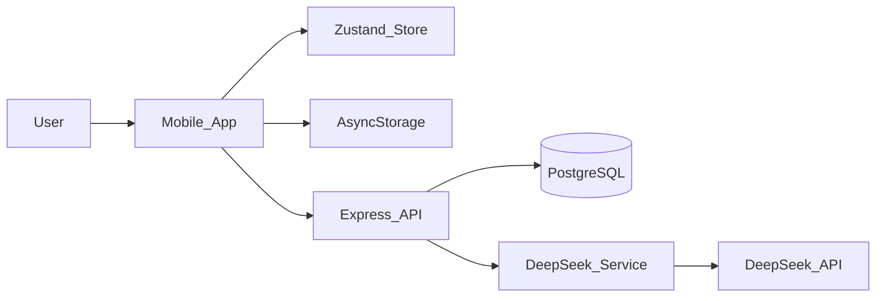

# AI 私教 — 技术文档

> 面向项目汇报与后续维护，保留重点信息：技术栈、技术架构、项目亮点，以及开发过程中遇到的问题、原因与解决措施。  
> 最后更新：2026-05-27

---

## 项目简介

AI 私教是一款面向健身小白的移动端 MVP，核心目标是把“信息采集、计划生成、执行打卡、饮食反馈、AI 对话调整”串成一个完整闭环。

当前已完成的核心能力：

- 短 ID + 密码注册登录
- 7 步用户信息采集
- AI 生成一周训练与饮食计划
- 计划确认与基于反馈的重生成
- 每日训练两阶段打卡
- 每周饮食反馈
- AI 教练流式对话

---

## 一、技术栈

### 前端

- `Expo` + `React Native`
- `React 19`
- `React Navigation`：`Stack + Bottom Tabs`
- `Zustand`：全局状态管理
- `AsyncStorage`：登录状态、onboarding 状态、活动计划持久化
- `TypeScript`

### 后端

- `Node.js` + `Express 5`
- `TypeScript`
- `pg`：PostgreSQL 访问
- `bcryptjs`：密码哈希
- `uuid`：主键与业务 ID 生成

### 基础设施

- `Supabase PostgreSQL`
- `DeepSeek Chat API`

---

## 二、技术架构

项目采用典型的前后端分离架构：

- 前端负责页面展示、用户交互、轻量状态缓存
- 后端负责业务编排、数据库读写、AI Prompt 组织与代理调用
- 数据库存储用户画像、计划草稿、确认计划、打卡记录、饮食反馈和聊天历史



### 前端架构重点

- `App.tsx` 负责应用启动时恢复本地状态，并根据 `userId / isOnboarded / activePlanId` 动态决定首屏
- `useAppStore.ts` 统一管理登录态、当前计划、草稿计划、当前周次、今日打卡完成状态
- `api/client.ts` 统一封装请求、超时控制和错误抛出
- 页面层按业务拆分：认证、onboarding、计划确认、今日训练、本周、聊天、个人中心、资料修改、打卡反馈、饮食反馈

### 后端架构重点

- `index.ts` 统一挂载用户、计划、打卡、对话、饮食 5 类路由
- `users.ts` 处理注册、登录、资料更新、资料读取
- `plans.ts` 处理计划生成、重生成、确认、活动计划读取
- `checkins.ts` 处理开始训练、完成训练、周打卡查询
- `diet.ts` 处理每周饮食反馈
- `chat.ts` 负责 AI 对话的 SSE 流式输出
- `deepseek.ts` 负责 Prompt 构建、AI 调用、失败兜底与流式解析

---

## 三、项目亮点

## 1. 训练计划不是“一次生成”，而是“确认后落库”

项目没有采用“生成后直接执行”的简单流程，而是设计为：

```text
信息采集 -> AI 生成草稿 -> 用户查看完整一周计划
-> 不满意可继续提反馈 -> 重生成
-> 用户确认后才写入正式计划
```

这样做的价值：

- 更贴近真实教练工作流
- 降低 AI 首次生成不符合预期的风险
- 让“用户反馈”真正进入计划生成闭环

## 2. 训练打卡与饮食反馈分离

项目没有把训练完成度和饮食完成度混在同一次反馈里，而是拆成两条独立业务流：

- **训练打卡**：每天执行
- **饮食反馈**：每周执行

这样更符合真实场景，因为用户训练结束后并不能立刻评价当天饮食情况。这个设计直接提升了业务逻辑的一致性。

## 3. 器材驱动的动态动作匹配

用户可在 onboarding 或个人资料页配置可用器材，如：

- 纯徒手
- 弹力带、瑜伽垫、跳绳
- 哑铃、杠铃、壶铃
- 固定器械、史密斯机、绳索等

后端在 Prompt 中把器材作为**硬约束**而不是普通参考项，要求 AI 只能在用户勾选的器材范围内安排动作。这让计划更可执行，也显著减少“器材不匹配”的无效方案。

## 4. 兼顾 Web 与 React Native 原生的聊天流式兼容

聊天模块支持流式输出，同时考虑到：

- Web 端支持 `ReadableStream.getReader()`
- React Native 原生端可能不支持同样的流式读取能力

因此实现了：

- Web：走流式 reader 解析
- 原生端：降级为 `text()` 一次性解析

这让同一套业务逻辑可以先支撑 Web Demo，再兼顾未来原生端扩展。

## 5. 状态恢复与轻量持久化

通过 `AsyncStorage` 持久化：

- 登录用户 ID / shortCode
- onboarding 完成状态
- 已确认活动计划

用户重启 App 后，不必重新登录和重新生成计划，能直接回到上一次工作状态，提升了 MVP 可用性。

## 6. 类型体系与共享组件的重构

在后期重构中，项目补充了：

- 共享类型：`WeeklyPlan`、`DayPlan`、`UserProfile`
- 共享组件：`Chip`、`PercentPicker`
- 统一 API client

这显著减少了重复代码和 `any` 带来的隐患，也让后续扩展（例如下一周计划、更多反馈类型）更容易落地。

---

## 四、核心实现逻辑

### 1. 登录与用户识别

项目采用简化后的账号体系：

- 注册时不使用手机号
- 系统自动生成短 ID
- 用户只需设置密码

适合自用/朋友场景，减少短信、验证码、风控等额外复杂度。

### 2. 计划生成逻辑

后端基于用户画像组织 Prompt，包括：

- 性别、身高、体重
- 训练目标
- 每周训练天数
- 每次训练时长
- 训练场景
- 运动基础
- 饮食忌口
- 可用器材

如果是第 2 周及以后，还会自动加入：

- 上周训练完成度
- 低完成度原因
- 饮食执行度
- 饮食标签和备注

因此计划生成不是静态模板，而是随反馈迭代的动态推荐。

### 3. 打卡逻辑

训练打卡分两步：

1. 点击“开始训练”  
2. 点击“完成训练”后填写完成度和备注

完成后会更新 `todayCheckInDone`，让“今日”页能正确显示已完成状态。

### 4. 聊天逻辑

聊天不是单纯问答，而是带上下文的教练对话：

- 用户画像进入 system prompt
- 当前周计划进入上下文
- 最近聊天记录进入历史上下文
- 推荐替代动作时必须遵守器材约束

这让 AI 回复更像“已有上下文的教练”，而不是一次性客服问答。

---

## 五、开发过程中遇到的关键问题与解决方案

## 1. PostgreSQL JSONB 字段读写不稳定

### 问题

`pg` 驱动在读取 JSONB 字段时，有时返回对象/数组，有时返回字符串，导致代码里直接 `JSON.parse()` 时出错。

### 原因

代码早期默认把数据库 JSONB 字段都当成字符串处理，但实际上驱动会自动反序列化部分 JSONB 数据。

### 解决措施

- 在服务端增加 `ensureObj()` / `ensureArr()` 安全解析函数
- 所有读取 JSONB 的地方统一走这两个函数
- DeepSeek prompt 中的 `diet_tags`、`equipment`、`diet_restrictions` 也统一做兼容处理

### 收益

消除了计划读取、饮食反馈、聊天上下文中的 JSON 解析错误。

## 2. Expo Web 启动很慢

### 问题

每次启动前端都非常慢，影响开发效率。

### 原因

开发时使用了 `npx expo start --web --clear`，每次都会强制清空 Metro 缓存，导致全量重新构建。

### 解决措施

- 改为日常使用 `npx expo start --web`
- 仅在缓存异常时才手动加 `--clear`
- 顺带清理了多余的 Expo 后台进程，释放端口和内存

### 收益

开发启动速度明显提升，机器内存压力下降。

## 3. Supabase schema 重复执行报错

### 问题

重复执行 `schema.sql` 时，索引创建报错：`relation already exists`

### 原因

`CREATE INDEX` 默认不是幂等的，重复执行会报错。

### 解决措施

- 将索引创建语句改为 `CREATE INDEX IF NOT EXISTS`
- 对新增唯一约束采用 `DO $$ BEGIN ... EXCEPTION WHEN duplicate_object THEN NULL; END $$`

### 收益

数据库初始化脚本可重复执行，更适合多人协作和后续维护。

## 4. 聊天页面曾出现白屏与字符串错误

### 问题

前端聊天页一度出现空白页和 `Unterminated string constant` 报错。

### 原因

早期文件中存在字符串编码异常，部分中文文本损坏，导致构建失败。

### 解决措施

- 重写 `ChatScreen.tsx`
- 统一修正中文字符串编码
- 重新梳理流式消息显示逻辑

### 收益

聊天模块恢复稳定，Web 端可正常工作。

## 5. 登录后重复进入信息采集页

### 问题

用户登录后，每次都要重新填写 onboarding 信息。

### 原因

`isOnboarded` 状态只保存在内存，没有持久化；登录后也没有根据用户资料判断是否已完成采集。

### 解决措施

- 用 `AsyncStorage` 持久化 `isOnboarded`
- 登录后主动请求用户资料
- 若已有目标与已确认计划，则直接进入主界面

### 收益

登录流程更符合真实使用习惯，避免重复填写表单。

## 6. 导航跨层级导致“点击没反应”

### 问题

曾出现：

- 退出登录点击无反应
- 训练完成后“返回首页”无反应

### 原因

项目使用了 `Stack + Bottom Tab` 组合导航，不同层级的路由名不能直接互相跳转。直接在错误层级调用 `navigate/reset` 会静默失败。

### 解决措施

- 退出登录时重置根导航器
- 从打卡完成页返回首页时使用嵌套路由跳转 `Main -> 今日`
- 修正相关页面的导航调用方式

### 收益

导航逻辑闭环，关键按钮恢复可用。

## 7. 个人信息保存了，但页面回显为空

### 问题

新用户填写了性别、身高、体重，但进入个人资料页时显示为空。

### 原因

数据库里其实已经保存成功，问题在于 `getUser` 接口的查询语句漏掉了 `gender / height / weight` 三个字段。

### 解决措施

- 补全 `SELECT` 语句字段
- 保证资料页读取接口和写入接口字段一致

### 收益

表单数据读写闭环完整，避免“已保存但看不到”的错觉。

## 8. 计划动作与用户器材不匹配

### 问题

如果只把器材作为普通资料字段，AI 可能仍会生成用户手头没有的器械动作。

### 原因

Prompt 中对器材信息描述不够强，模型会把它当作参考信息而不是硬约束。

### 解决措施

- 扩展器材选项颗粒度
- 在 Prompt 中加入明确约束：
  “所有动作必须严格限制在用户可用器材范围内”
- 聊天推荐替代动作时同样使用器材白名单

### 收益

计划可执行性显著提升，更符合真实训练条件。

---

## 六、当前项目状态与后续建议

当前 MVP 已经具备完整雏形，主要链路都能跑通，适合：

- Demo 演示
- 小范围自用/朋友试用
- 后续继续迭代为正式产品

下一阶段最值得投入的方向：

1. 增加真正的鉴权机制（token / session）
2. 实现“下周计划生成”前端入口
3. 实现“开始了但没结束，自动视为 100% 完成”的规则
4. 完善原生端聊天流式体验
5. 将局域网 IP 与生产地址改为环境配置

---

## 七、结论

这个项目的价值不只在于“做了一个 AI 健身 App”，更在于它已经具备了较完整的软件工程闭环：

- 前后端分离
- 明确的数据模型
- 可迭代的 AI 计划生成链路
- 状态持久化与错误处理
- 针对开发中真实问题的排查、修复与重构

从 MVP 阶段来看，项目已经具备继续产品化演进的基础。
